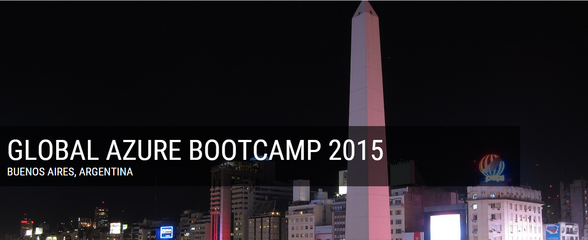

# Global Azure Bootcamp 2015 - Buenos Aires, Argentina

En este repositorio van a encontrar todo el material presentado durante el [Global Azure Azure Bootcamp 2015 en Buenos Aires, Argentina](http://argentina.azurebootcamp.net) el dia 25 de Abril de 2015.

### Charlas

1. [Introducción](https://github.com/southworkscom/GAB-Arg-2015/tree/master/1%20-%20Intro)
2. [Desarrollo de Back Ends para Aplicaciones Moviles](https://github.com/southworkscom/GAB-Arg-2015/tree/master/2%20-%20Azure%20Mobile%20Services)
3. [Azure para DBA´S SQL Server](https://github.com/southworkscom/GAB-Arg-2015/tree/master/3%20-%20Azure%20DBA%20SQL)
4. Performance con Azure Search y Redis
5. [Construyendo aplicaciones Media con Microsoft Azure Media Services](https://github.com/southworkscom/GAB-Arg-2015/tree/master/5%20-%20Azure%20Media%20Services)
6. Introduccion a Visual Studio Online
